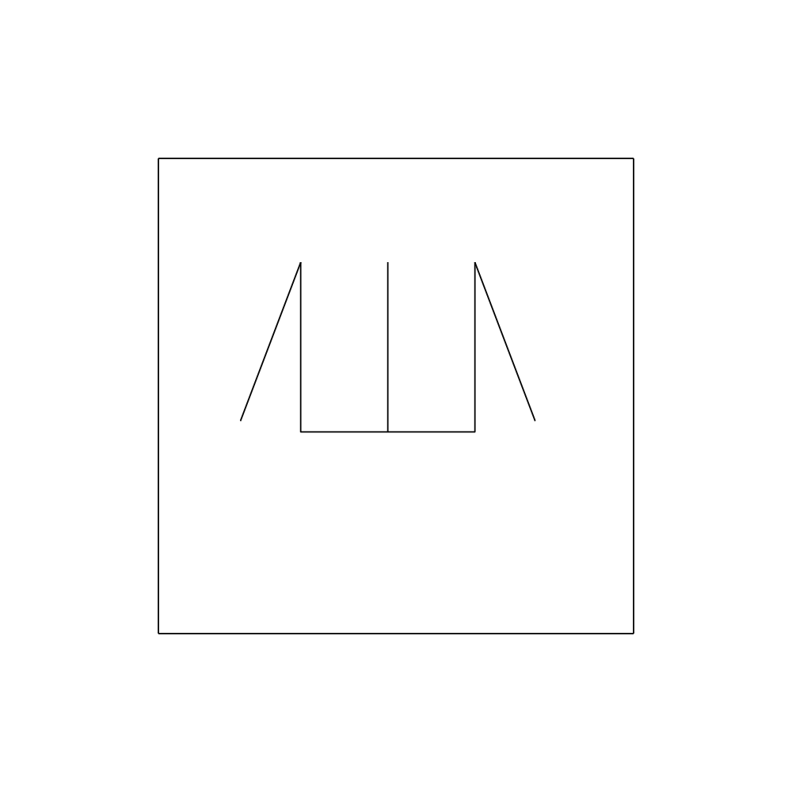
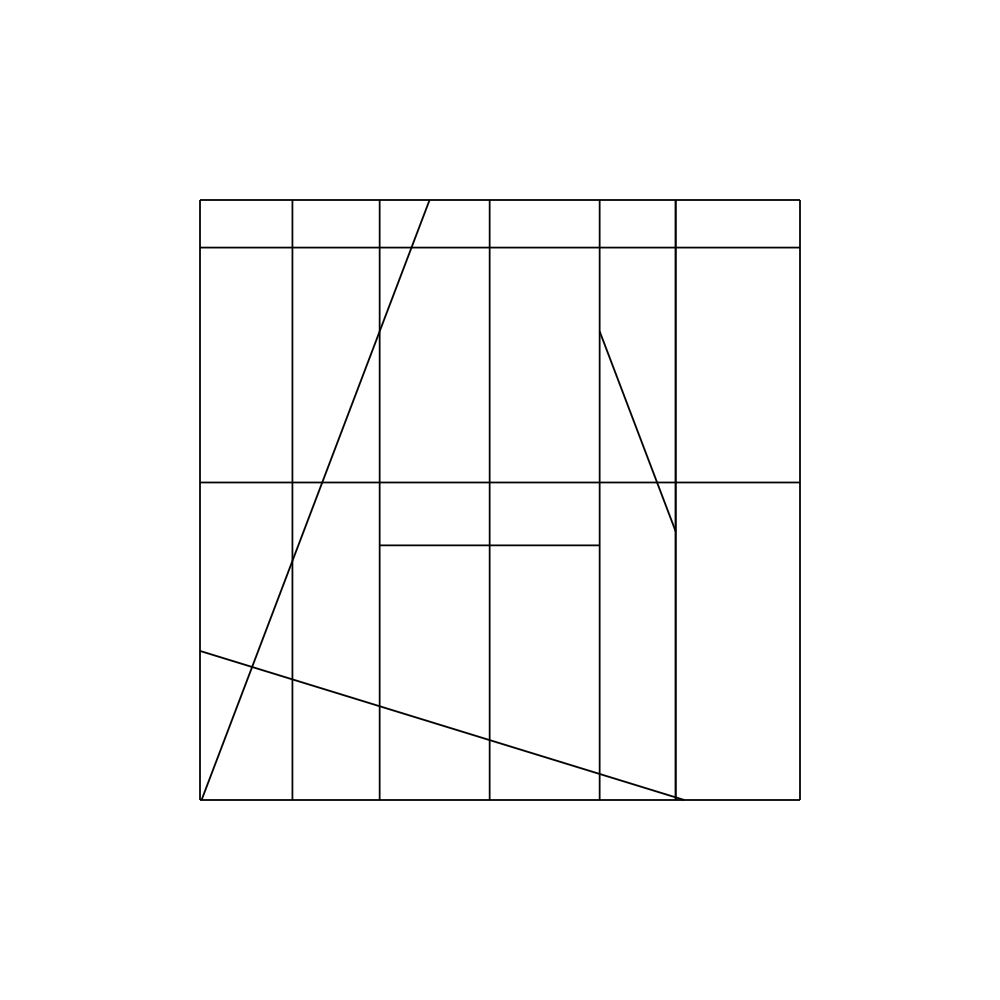
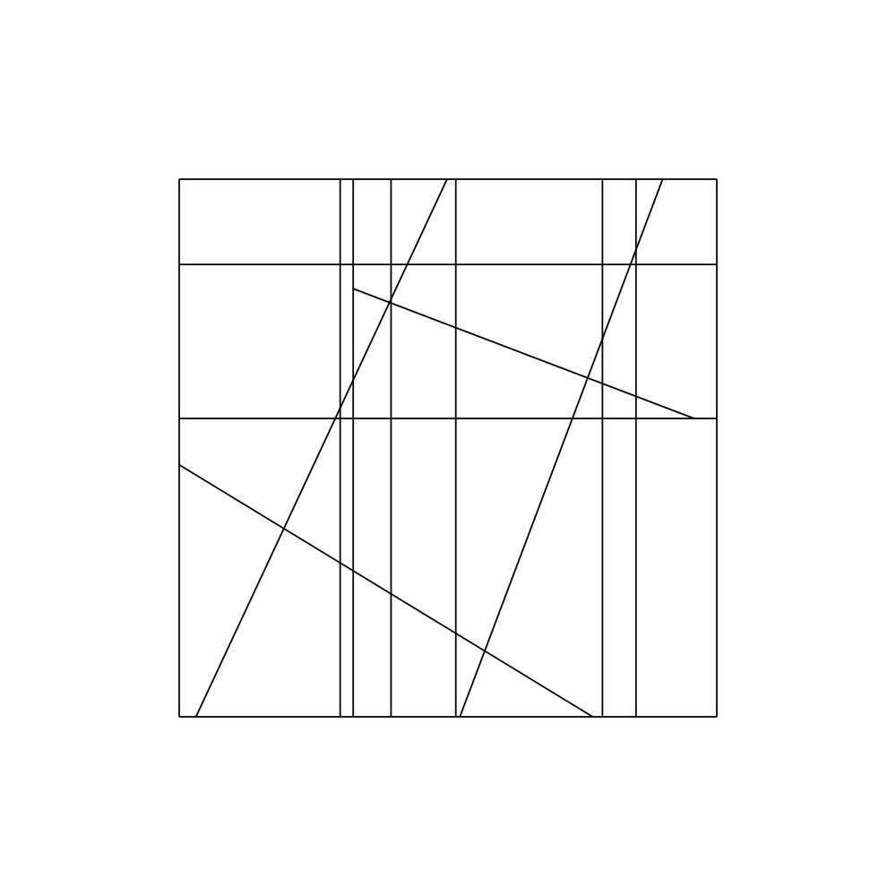

# leftstim: L-EFT stimuli generation







This Python project is for generating stimuli images to be used in implementations of the Leuven Embedded Figures Test (L-EFT - [original article](https://peerj.com/articles/2862/) ). It heavily relies on the [PsychoPy](https://psychopy.org/) package as it acts as an interface for building, drawing and saving stimuli images. The main mode of interacting with the `leftstim` package, which holds all the Python code is using the `LeftImage` class and its methods.

## Setup
This project uses __Python 3.8__, as this is the version of Python recommended for use with the `psychopy` package at the time (2022-05-02).

First, you must have installed all dependencies listed in 'requirements.txt'. The best way to do this is to create a virtual environment and then use pip to install the necessary packages. Here's an example of how this can be done on a Mac:

```py
cd 'path/to/this/directory'
python3.8 -m venv .venv
. ./venv/bin/activate
pip install -r requirements.txt
```
Remember that you need to `cd` to this directory and rerun `. ./venv/bin/activate` whenever you've closed down your terminal and want to continue using this project.

## Using the package
It might be easiest to start with an example script and seeing what it does - in that case, you can check out the root directory file 'example_generation_simple.py'.
```py
# activate virtual environment
. ./venv/bin/activate
python example_generation_simple.py
```
There are also a couple of other example scripts, demonstrating additional functionality, in the 'example_scripts' directory. If you want to run these additional example scripts, __you must first move/copy them to the root directory__, and the same thing goes for any scripts you create yourself.

Note that you **must** follow the order of operations outlined below, otherwise the package does not function correctly. This is a known shortcoming. You can choose to skip some of the operations, e. g. random positioning of the figure, but the order has to stay the same.

### Image creation
To start creating an image, you need to create an instance of the LeftImage class.
```py
my_img = LeftImage(window_width=500, 
				   window_height=500, 
				   frame_width=300, 
				   frame_height=300,
				   line_width=1.8,
				   line_color=(-1, -1, -1),
				   background_color=(1, 1, 1),  
				   units="pix")
```
Window width/height refers to size (in the specified units - pixels is recommended unless you really know what you're doing) of the canvas/window that in turn holds the black frame within which stimuli are drawn. Please take a look at the [original L-EFT stimuli](https://figshare.com/articles/Leuven_Embedded_Figures_Test_Context_Shapes/3807894) to understand this better. Colors are specified using RGB values ranging from -1 to 1.

### Adding a figure
This package only supports using one figure (not multiple ones), as all original L-EFT stimuli only use one figure.
```py
my_img.add_figure_by_name('C3')
```
Pre-built figures that come with the package are named using the convention <A-D><1-4>, based on [this image from the L-EFT's developers](https://www.ncbi.nlm.nih.gov/pmc/articles/PMC5267572/figure/fig-1/). E. g. A1 corresponds to a triangle, A2 to a square and A3 to a hexagon. You can also use `my_img.add_random_figure()` to randomly pick one of the pre-built figures and add it to the LeftImage instance.

Alternatively you can create your own figure:
```py
l1p1 = Point(x=0, y=0)
l1p2 = Point(x=100, y=0)
l2p1 = Point(x=100, y=0)
l2p2 = Point(x=100, y=100)
l3p1 = Point(x=100, y=100)
l3p2 = Point(x=0, y=100)
l4p1 = Point(x=0, y=100)
l4p2 = Point(x=0, y=0)
l1 = Line(start_point=l1p1,
		  end_point=l1p2)
l2 = Line(start_point=l2p1,
		  end_point=l2p2)
l3 = Line(start_point=l3p1,
		  end_point=l3p2)
l4 = Line(start_point=l4p1,
		  end_point=l4p2)
line_ls = [l1, l2, l3, l4]
frame_to_use = my_img.frame
square_poly = figure(lines=line_ls,
					  frame=frame_to_use)
my_img.add_figure(square_poly)
```
Note that even if some of the lines that make up the figure has the same coordinates for one of its points as the coordinates for another line's points (eg l1p2 and l2p1), you still need to create separate points for each of them, because of the way the package works.

### Randomly positioning the figure
If you want, you can randomly position the figure within the frame (though always keeping a certain distance from the frame, so that the figure is not attached/linked to it):
```py
my_img.randomly_position_figure()
```

### Align the figure with the frame
If you want, you can attempt to align the figure with the frame, meaning that the figure is moved horizontally or vertically so that one of its lines is aligned with one of the frame's lines. A check will be done to see if this is possible (i. e. if the figure has vertical/horizontal lines at its borders), otherwise False is returned.
```py
my_img.align_figure_with_frame()
```

### Shift the figure to the frame
If you want, you can attempt to shift the figure to the the frame, meaning that the figure is moved horizontally or vertically so that one of its points lies on one of the frame's lines. A check will be done to see if this is possible(i. e. if the figure has not already been aligned with/shifted to the frame), otherwise False is returned.
```
my_img.shift_figure_to_frame()
```

### Extending figure lines
L-EFT stimuli difficulty levels are mainly based on what proportion of the embedded figure's lines are stretched out so that they extend to the frame's sides. Right now, there are two methods for doing this:
```py
my_img.extend_two_thirds_figure_lines()
#or
my_img.extend_all_figure_lines()
```

### Closing free figure endpoints
L-EFT stimuli do not allow for figure lines to have 'free ends', i. e. points that are only connected to by one line. To 'close' these points, use:
```py
my_img.close_figure_free_points()
```

### Growing lines from figure points
Oftentimes in L-EFT stimuli there are lines drawn between two of the frame's sides, that intersect points of the embedded figure. To do this, use:
```py
my_img.grow_figure_line()
```
The function call will return True if a line was successfully grown from a figure point, otherwise it returns False (this happens if lines have been grown from all of the figure's points).

### Adding random lines
To add random lines to the image with a specified orientation, use:
```py
my_img.add_random_line(orientation)
```
Where `orientation` holds a string with value 'horizontal', 'diagonal' or 'vertical'. Added lines may stretch between any of the lines already in the image, including frame, figure and random lines. The probability of each kind of line has been weighted to increase the chance of images similar to the original LEFT stimuli being produced.

### Saving the image
Once the above methods have been used to create an image instance and add elements, you can save it:
```py
my_img.save_image_and_context(directory_path)
```
Where `directory_path` is a path to the directory where you want to save the image. Note that apart from the image you've built, this method call will also produce a similarly-named file, where the figure has been replaced with random lines and all other lines have been shifted slightly (see third image in example images at top of this README).

## Limitations
Note that the package isn't perfect; you might find that only about one in five or one in ten of all the generated sets of images are appropriate for use. You might also sometimes see messages printed when running the script which indicate that part of the stimulus generation had to be tweaked (e.g. if it turned out that two lines were parallel, meaning they couldn't be extended to intersect each other). Please be patient and use e.g. for loops for producing a large set of images so that you can then pick the ones that seem the most fitting (see 'example_scripts/example_generation_massproduction_changecolors.py').

## Attribution
The Leuven Embedded Figures Test was developed by Lee de-Wit​​, Hanne Huygelier​, Ruth Van der Hallen, Rebecca Chamberlain and Johan Wagemans. This project's Python code was developed by Lowe Wilsson for a synesthesia research group at Karolinska Institutet, led by Janina Neufeld.

The original set of L-EFT stimuli as well as all material here are licensed under [CC BY 4.0](https://creativecommons.org/licenses/by/4.0/), meaning you are free to use and modify everything in this project, __provided that you include proper attribution__. You are required to cite this article:

> De-Wit, L., Huygelier, H., Van der Hallen, R., Chamberlain, R., & Wagemans, J. (2017). Developing the Leuven Embedded Figures Test (L-EFT): testing the stimulus features that influence embedding. PeerJ, 5, e2862.

Additionally, though it's not required you are very welcome to link to [this project's GitHub repository](https://github.com/anonzebra/leftstim) so that others can find it.